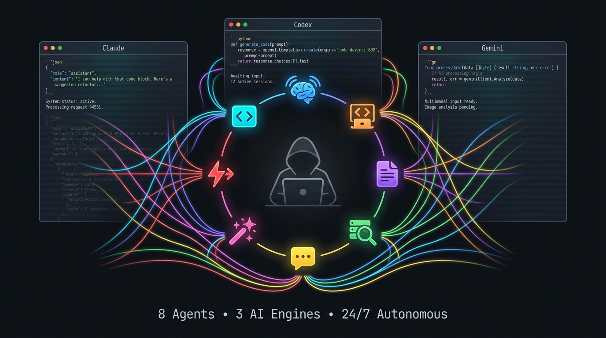

## Hey, I'm Mingcan (Mitchell) 👋

I build systems that make models faster and smaller — from pruning multi-task networks to accelerating image/ video diffusion transformers.

### 🔬 Research

- **Efficient Generative Models** — sparse attention, linear attention, and inference acceleration for image/video diffusion transformers
- **Multi-Task Learning** — adaptive pruning frameworks for jointly-trained models
- **Model Compression** — structured pruning, quantization, knowledge distillation

### 🤖 Power User: 8 AI Agents Working for Me 24/7

I run a fleet of 8 specialized AI agents on [OpenClaw](https://github.com/openclaw/openclaw) that orchestrate **Claude, Codex, and Gemini** to handle my daily workflow autonomously.

They dispatch coding tasks to remote GPU clusters, monitor my inbox, write research reports, review PRs, and sync everything to Notion — while I sleep.

> *The best AI setup isn't the smartest model — it's the best memory, tools, and orchestration around it.*
